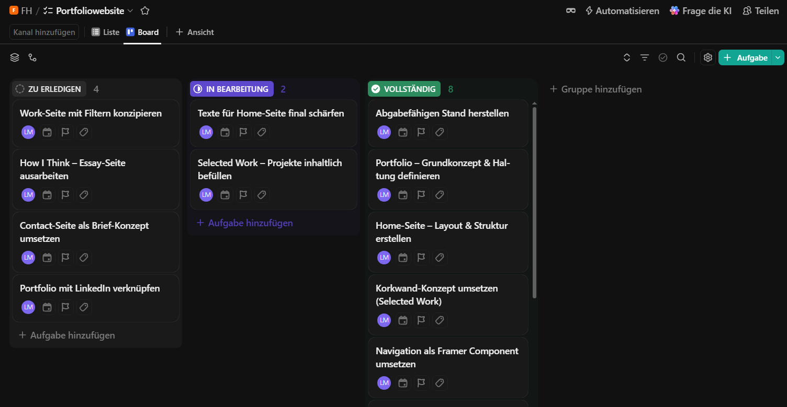

= Portfolio Website

== Art des Portfolio

Ich mache eine Website mit Framer, dass ich zeige, dass ich nicht nur hands on arbeiten kann, sondern auch fertige Produkte verwenden kann.

== Personas

link:personas.pdf[zum Pdf]

== Employer Recruiting Journey Map

link:employer-recruiting-journey-map.pdf[zum Pdf]

== Erste Entwürfe

link:portfoliowebsite.pdf[zum Pdf]

== Zur derzeitigen Portfolio Website

link:https://lydiareiter.framer.website/[]

== Kanban Board

link:https://app.clickup.com/90151093437/v/li/901519468206[zum Board]

== Zwischenpräsentation

link:zwischenpräsentation.pdf[zur Pdf]